# 视消云小程序 - UI设计规范

## 一、设计系统基础

### 1.1 颜色系统

#### 品牌色与辅助色
| 色彩名称 | 色值 | 使用场景 |
|---------|------|---------|
| 品牌蓝 | #4458ff | 主要品牌色，按钮、强调元素 |
| 辅助蓝 | #1386ff | 链接、次要操作 |
| 辅助红 | #f34545 | 警告、删除、错误提示 |
| 辅助橙 | #ff7437 | 重要提醒、待处理状态 |
| 辅助黄 | #ff9317 | 普通提醒、提示信息 |
| 成功提示 | #0fbc91 | 成功状态、完成提示 |

#### 中性色
| 色彩名称 | 色值 | 使用场景 |
|---------|------|---------|
| 背景色 | #F5F6FA | 页面背景 |
| 分割线/卡片背景 | #E5E6EA | 分割线、卡片背景 |
| 边框 | #D8D9DC | 输入框边框、分隔线 |

#### 字体色
| 色彩名称 | 色值 | 使用场景 |
|---------|------|---------|
| 标题文字 | #17171a | 页面标题、重要信息 |
| 正文 | #656a73 | 正文内容、主要信息 |
| 辅助 | #a7abb2 | 辅助说明、次要信息 |

### 1.2 字体规范

**设计基准：** @1x图下为基准换算单位
- **iOS默认字体：** 中文 PingFang SC 苹方，数字 Helvetica
- **Android默认字体：** 中文 思源黑体，数字 Roboto

#### 字阶体系
| 字阶 | 字号 | 字重 | 行高 | 使用场景 |
|-----|------|------|------|---------|
| T1 | 24pt | 600 | 32pt | 特大标题（主要文本信息） |
| T2 | 18pt | 500/400 | 26pt | 大标题（主要文本信息及顶部导航文字） |
| T3 | 16pt | 500/400 | 22pt | 正文字体（主要文本信息） |
| T4 | 14pt | 400 | 20pt | 辅助说明（次要文本信息） |
| T5 | 12pt | 400 | 16pt | 辅助级文案（如补充性推送） |
| T6 | 10pt | 400 | 14pt | 备注级文案（如底部tab，tag文本） |

### 1.3 布局规范

#### 设计基准
- **设计画板尺寸：** 375 × 812
- **栅格基数：** 4
- **步进规则：** 所有padding、margin、sizing都是4的倍数

#### 间距规范
| 间距类型 | 尺寸 | 使用场景 |
|---------|------|---------|
| W4 | 16px | 界面内和屏幕左右间距，可点击icon之间间距 |
| W3 | 12px | 左图右文结构，图片文字左右间距 |
| W2 | 8px | 左icon右文字结构，icon文字左右间距 |
| W1 | 4px | 元素之间最小间距 |

#### 卡片规范
- **圆角：** 8px
- **边框：** 16px
- **卡片内元素上下间距：** 4px

#### 弹窗规范
- **圆角：** 8px
- **左右边框：** 24px
- **上边框：** 20px
- **下边框到按钮间距：** 24px
- **弹窗内元素上下间距：** 16px
- **"确定"等按钮高度：** 56px

#### 表单/输入
- **总高：** 56px

---

## 二、通用组件规范

### 2.1 按钮组件

#### 按钮类型
1. **主要按钮**
   - 大按钮（宽度自适应）
   - 中按钮
   - 小按钮

2. **次要按钮**
   - 中按钮

3. **按钮组**
   - 支持多个按钮组合排列

#### 按钮状态
| 状态 | 视觉效果 |
|-----|---------|
| 正常 | 默认样式 |
| 点击 | 增加10%黑色蒙版 |
| 加载 | 显示加载动画 |
| 不可点击 | 灰色样式，降低透明度 |

**参考图：**

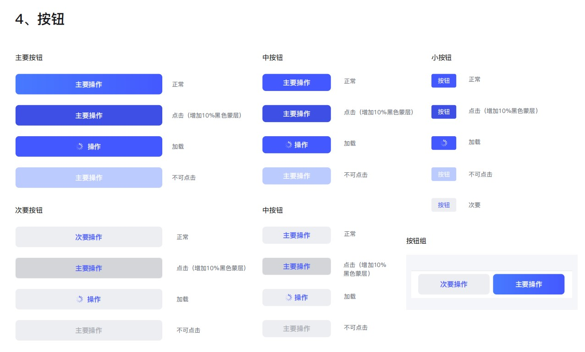

### 2.2 导航组件

#### 底部Tab导航（4栏）
- **栏目：** 首页、场所、消息、我的
- **间距：** 28px
- **导航按钮宽度：** 56px
- **状态：** 选中/未选中

#### 顶部导航
- **样式类型：** 两栏、三栏、四栏
- **字体：** T2字阶（18pt）
- **状态：** 选中/未选中

#### 小程序导航
- **一级导航栏**
- **二级导航栏**

**参考图：**

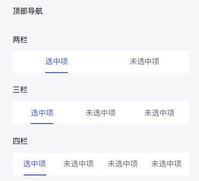

### 2.3 数据录入组件

#### 搜索框
1. **普通搜索框**
   - 带搜索图标
   - 占位符文字

2. **搜索框+取消**
   - 带搜索图标
   - 右侧取消按钮

**参考图：**

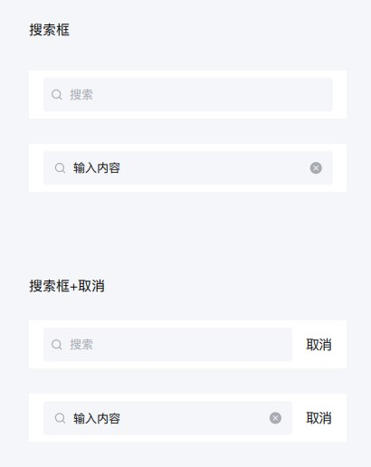

#### 表单输入
| 输入类型 | 视觉元素 | 使用场景 |
|---------|---------|---------|
| 带右箭头输入 | 右侧箭头图标 | 跳转选择页面 |
| 必须输入（带星号） | 左侧红色星号 | 必填项 |
| 带叉号的输入 | 右侧清除图标 | 可快速清除内容 |
| 输入时不带 | 纯输入框 | 一般输入 |
| 输入错误 | 右侧感叹号+下方红色错误提示 | 验证失败 |

**参考图：**

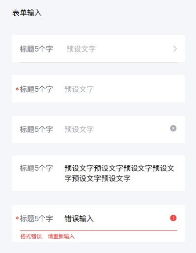

### 2.4 数据展示组件

#### 数字标签
- **红点：** 未读提示
- **1-99：** 具体数字
- **99+：** 超过99条

**参考图：**

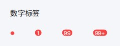

#### 小标签
- 蓝色、绿色、橙色、红色、灰色
- **使用场景：** 状态标识、分类标签

#### 中标签
- 蓝色、绿色、橙色、红色
- **使用场景：** 重要状态标识

#### 大标签
- **选中状态**
- **未选中状态**
- **使用场景：** 筛选、分类切换

**参考图：**

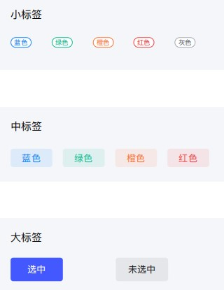

#### 通告栏
| 通告类型 | 图标 | 颜色 | 使用场景 |
|---------|------|------|---------|
| 提示通告栏 | 喇叭图标 | 辅助黄 | 消息推送 |
| 成功通告栏 | 绿色对钩 | 成功提示色 | 成功提示 |
| 警示通告栏 | 红色感叹号 | 辅助红 | 警告提示 |

**参考图：**

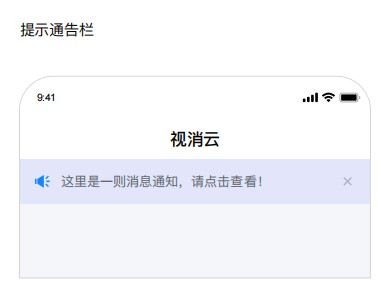

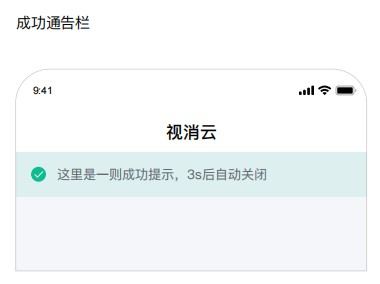

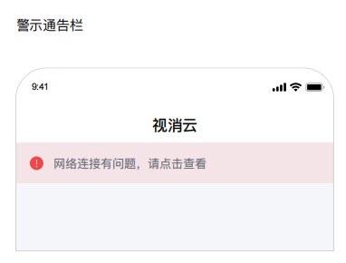

#### 头像
- **4种不同尺寸：** 大、中、小、超小
- **形状：** 圆形
- **默认头像：** 系统默认头像

**参考图：**

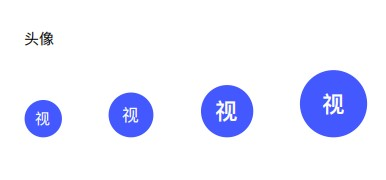

### 2.5 列表组件

#### 列表类型
1. **纯文字单行列表**
2. **说明单行列表**
3. **图标+说明单行列表**
4. **双行纯文字**
5. **图标+双行纯文字**
6. **多选列表**
7. **单选列表**

**参考图：**

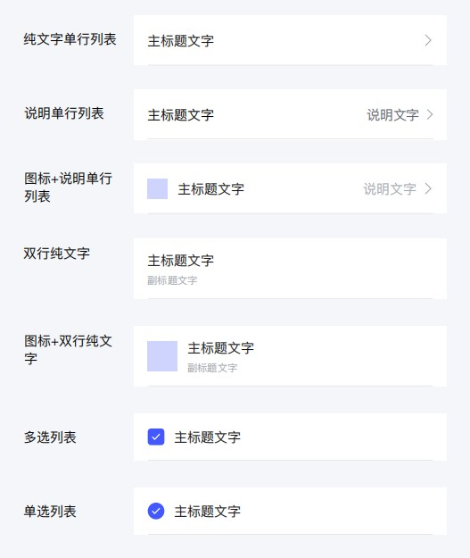

#### 列表分区
**分区一标题：**
- 宽度：60px
- 下方说明文字：最多2行
- 说明文字间距：8px

**分区二标题：**
- 与分区一间距：24px

**参考图：**

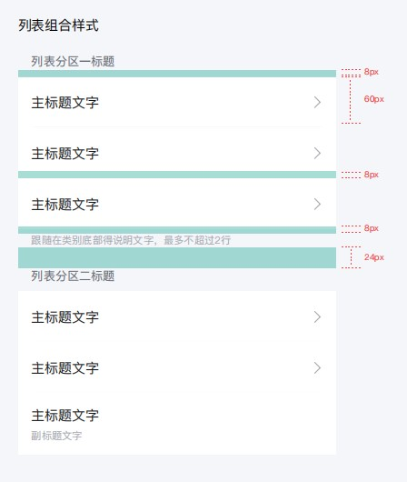

### 2.6 操作反馈组件

#### 气泡
1. **顶部功能气泡**
   - 从顶部弹出
   - 自动消失

2. **底部菜单气泡**
   - 从底部弹出
   - 操作菜单列表

**参考图：**

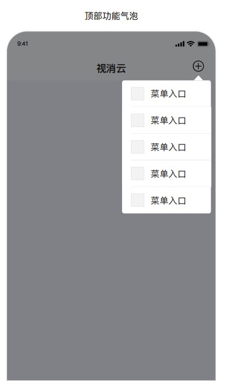

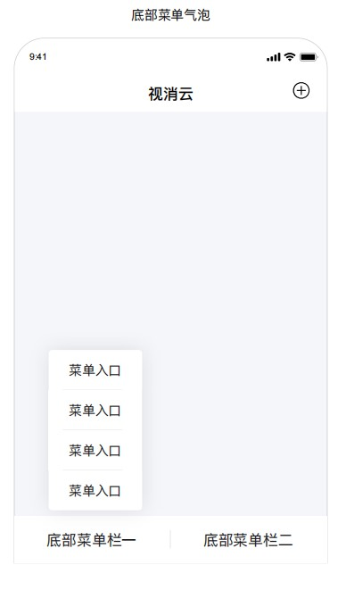

#### 弹窗
1. **常用弹窗**
   - 标题+内容+确定按钮

2. **两项操作弹窗**
   - 标题+内容+取消+确定

3. **输入弹窗**
   - 标题+输入框+取消+确定

4. **底部弹窗**
   - 从底部滑出
   - 选项列表

**参考图：**

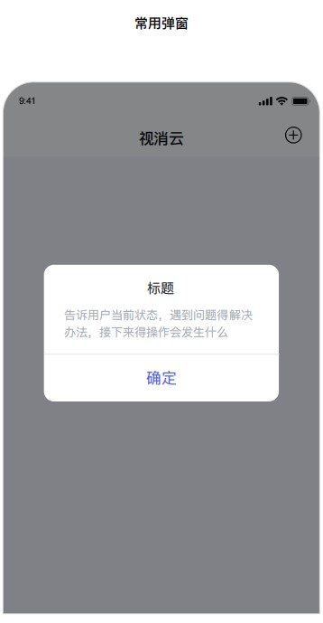

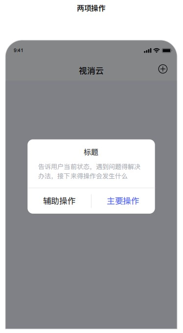

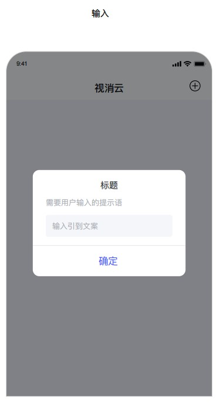

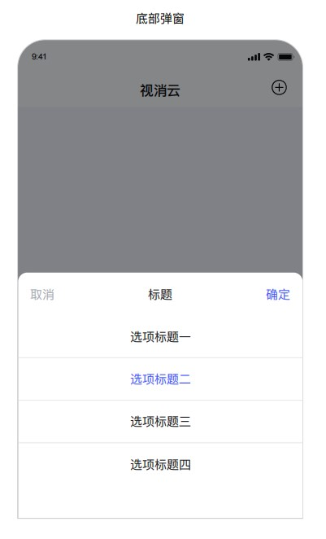

---

## 三、页面UI设计要求

### 3.1 底部Tab页

#### 首页
- **功能：** 待定
- **导航：** 底部Tab第一项
- **状态图标：** 选中/未选中

#### 发现页
- **顶部导航：** 两栏（活动、社区）
- **切换方式：** 点击tab切换内容

##### 发现页 - 活动Tab
**任务推送模块：**
- 支持外部链接点击跳转
- 任务卡片样式
- 任务状态标识

**积分兑换模块：**
- 积分商城入口
- 大转盘抽奖入口
- 积分余额显示

##### 发现页 - 社区Tab
**社区分类：**
- 官方资讯
- 产品建议
- 新品测评
- 好物分享

**内容展示：**
- 支持文字、图片、视频
- 视频转发功能（好友、群聊、朋友圈）

#### 商城页
- **功能：** 嵌入mall.wisualarm.com
- **实现方式：** WebView嵌入
- **导航：** 底部Tab第三项

#### 我的页
**未登录状态：**
- 登录/注册入口
- 游客可访问功能

**已登录状态：**
- 头像+昵称
- 个人信息
- 功能菜单

**功能菜单列表：**
- 我的积分
- 个人信息
- 安全中心
- 绑定CRM系统
- 隐私协议
- 服务协议

### 3.2 登录/注册页面

#### 登录页
**登录方式：**
1. 手机号快捷登录
2. 手机验证码登录
3. 微信登录

**页面元素：**
- Logo
- 登录方式切换
- 手机号输入框
- 验证码/密码输入框
- 登录按钮
- 隐私协议勾选
- 注册入口

#### 注册页
**必填信息：**
- 昵称
- 手机号
- 邮箱
- 邮箱验证码
- 密码

**页面元素：**
- 表单输入框（带必填星号）
- 发送验证码按钮（60s倒计时）
- 注册按钮
- 隐私协议勾选

### 3.3 个人信息页

**显示信息：**
- 头像（可点击修改）
- 昵称
- 账号
- 电话

**列表样式：**
- 左文字+右内容+右箭头
- 可点击项带右箭头

### 3.4 安全中心页

**功能列表：**
- 修改密码

**修改密码页面：**
- 旧密码输入
- 新密码输入
- 确认密码输入
- 提交按钮

### 3.5 绑定CRM系统页

**页面功能：**
- CRM账号绑定
- 绑定状态显示
- 解绑功能

**用途说明：**
- 识别老客户
- 派发专属任务

### 3.6 我的积分页

**顶部展示：**
- 当前积分总数（大号字体）
- 赚积分入口
- 积分规则说明

**Tab切换：**
1. **积分流水**
   - 时间
   - 积分变动
   - 来源说明
   - 当前余额

2. **兑换记录**
   - 兑换时间
   - 兑换商品
   - 消耗积分
   - 兑换状态

### 3.7 赚积分页

#### 签到积分
- **签到控件：** 日历样式
- **连续签到提示**
- **签到按钮**
- **签到奖励说明**

#### 任务积分
**任务类型分类：**
1. 限时任务
2. 新手任务
3. 专属客户任务（CRM老客户）

**任务入口：**
- 统一展示入口
- 推送广告
- 消息滚动栏

**任务卡片：**
- 任务标题
- 任务说明
- 积分奖励（醒目显示）
- 任务状态（进行中/已完成/已过期）
- 参与按钮

### 3.8 任务详情页

#### 问卷报名任务
- 海报说明图
- 跳转问卷按钮
- 问卷链接
- 积分奖励说明
- 提交后积分到账

#### 朋友圈分享任务
- 分享海报图片
- 保存图片按钮
- 上传截图入口
- 提交按钮
- 审核说明

#### 视频任务
- 任务说明
- 视频要求
- 上传视频入口
- 提交按钮
- 审核说明

#### 投票任务
- 投票主题
- 投票选项
- 提交按钮
- 积分奖励说明

### 3.9 积分商城页

**顶部：**
- 我的积分余额
- 兑换记录入口

**商品分类Tab：**
- 全部
- 虚拟卡券
- 现金红包
- 优惠券
- 增值服务

**商品卡片：**
- 商品图片
- 商品名称
- 所需积分
- 库存状态
- 兑换按钮

**兑换弹窗：**
- 商品信息确认
- 积分消耗提示
- 确认兑换按钮

### 3.10 大转盘抽奖页

**页面元素：**
- 转盘组件（8个奖品位）
- 中心抽奖按钮
- 我的积分余额
- 抽奖消耗积分说明
- 中奖记录
- 活动规则

**奖品类型：**
- 积分（随机）
- 优惠券
- 红包
- 谢谢参与

### 3.11 兑换记录页

**列表展示：**
- 兑换时间
- 商品图片
- 商品名称
- 消耗积分
- 兑换状态（待发货/已发货/已完成）

**卡券信息展示：**
- 卡号
- 卡密
- 使用说明

### 3.12 微信提现页

**提现表单：**
- 提现金额输入
- 可提现金额显示
- 提现说明
- 提交按钮

**提现记录：**
- 提现时间
- 提现金额
- 提现状态（审核中/已到账/已驳回）

---

## 四、后台管理系统UI要求

### 4.1 统计数据页

**数据展示：**
- 时间筛选（昨日、今日、近7日、近30日）
- 参与任务账户数量统计
- 参与人数任务排行榜

**图表类型：**
- 折线图（趋势）
- 柱状图（对比）
- 排行榜列表

### 4.2 积分商城管理

#### 礼品管理列表
**列表字段：**
- 礼品图片
- 礼品名称
- 商品类型
- 所需积分
- 库存
- 已兑换数量
- 状态（上架/下架）
- 操作（编辑/删除）

#### 礼品上架/编辑
**表单字段：**
- 礼品图片上传
- 礼品名称
- 商品类型选择
- 所需积分
- 库存设置
- 兑换规则
  - 每人限兑换次数
  - 指定客户
  - 黑名单
- 卡信息（虚拟卡券）
  - 批量导入卡号卡密
  - 卡信息列表展示

#### 兑换记录
**列表字段：**
- 兑换时间
- 用户信息
- 商品名称
- 消耗积分
- 兑换状态
- 操作（发货/查看详情）

#### 微信提现记录
**列表字段：**
- 申请时间
- 用户信息
- 提现金额
- 消耗积分
- 提现状态
- 操作（审核/查看详情）

**对账功能：**
- 财务对账报表导出
- 对公支付账户信息

### 4.3 任务管理

#### 任务列表
**列表字段：**
- 任务名称
- 任务类型
- 积分奖励
- 参与人数
- 任务时效
- 任务状态
- 操作（编辑/删除/查看数据）

#### 任务创建/编辑
**任务模板库：**
- 培训
- 会议签到
- 安装设备积分
- 活动报名
- 材料收集
- 意见反馈
- 满意度调查
- 考试答题
- 投票
- 市场调研问卷
- 登记后领取资料

**表单配置：**
- 任务名称
- 任务类型选择
- 任务模板选择/空白新建
- 任务内容编辑（类似草料二维码的模块化编辑）
- 积分规则设置
- 任务条件
  - 参加次数限制
  - 限定客户（新用户/指定客户群）
  - 任务时效
  - 任务审核（自动/人工）

#### 任务审核
**人工审核列表：**
- 提交时间
- 用户信息
- 任务名称
- 任务内容查看
- 审核状态
- 操作（通过/驳回）

**任务内容查看：**
- 根据任务类型展示
  - 问卷：查看问卷内容
  - 图片：查看上传图片
  - 视频：查看上传视频

**自动审核规则：**
- 签到积分：自动通过
- 其他可配置自动审核的任务

### 4.4 用户管理

**用户列表：**
- 用户头像
- 用户昵称
- 手机号
- 注册时间
- 当前积分
- CRM绑定状态
- 操作（查看详情/编辑）

**用户详情：**
- 基本信息
- 积分流水
- 兑换记录
- 任务参与记录

### 4.5 系统设置

**积分规则设置：**
- 签到积分规则
- 任务积分规则
- 积分有效期

**协议管理：**
- 隐私协议编辑
- 服务协议编辑

**黑名单管理：**
- 添加/移除黑名单
- 黑名单列表

**客户群管理：**
- 创建客户群
- 客户群列表
- 指定用户到客户群

---

## 五、特殊交互说明

### 5.1 游客模式
- 允许浏览部分内容
- 参与具体活动时弹出登录/注册页
- 登录后自动跳转回原页面

### 5.2 外部链接跳转
- 任务推送支持外部链接
- 点击后跳转到小程序内对应页面
- 保持导航连贯性

### 5.3 视频转发
- 支持转发好友
- 支持转发群聊
- 支持转发朋友圈
- 使用微信原生分享组件

### 5.4 加载状态
- 页面加载：显示骨架屏
- 按钮加载：显示加载动画
- 列表加载：显示加载更多

### 5.5 空状态
- 无数据时显示空状态插图
- 提示文字说明
- 引导操作按钮

### 5.6 错误处理
- 网络错误：显示错误提示+重试按钮
- 表单验证错误：红色提示+感叹号
- 操作失败：Toast提示

---

## 六、响应式适配说明

### 6.1 小程序适配
- 使用rpx单位进行响应式适配
- 基准尺寸：375px（iPhone 6/7/8）
- 1px = 2rpx

### 6.2 安全区域
- 适配iPhone刘海屏
- 底部安全区域适配
- 使用安全区域API

### 6.3 横屏适配
- 部分页面支持横屏（如视频播放）
- 横屏时重新布局

---

## 七、动画效果

### 7.1 页面切换
- 右滑进入，左滑退出
- 使用系统默认动画

### 7.2 Tab切换
- 无动画，直接切换内容
- 指示器滑动动画

### 7.3 弹窗动画
- 从中心缩放进入
- 淡出退出

### 7.4 底部弹窗
- 从底部滑入
- 向下滑出

### 7.5 列表加载
- 上拉加载：显示加载动画
- 下拉刷新：使用系统默认刷新样式

---

## 八、设计文件交付

### 8.1 设计稿
- Figma/Sketch源文件
- 标注完整的设计稿
- 切图资源（@1x, @2x, @3x）

### 8.2 图标资源
- 导航图标（选中/未选中）
- 功能图标
- 状态图标
- SVG格式或PNG格式

### 8.3 设计规范文档
- 组件库说明
- 交互规范说明
- 视觉规范说明

---

## 九、开发注意事项

### 9.1 性能优化
- 图片使用webp格式
- 大图使用懒加载
- 列表使用虚拟列表

### 9.2 用户体验
- 关键操作给予反馈
- 加载状态及时展示
- 错误提示友好明确

### 9.3 无障碍支持
- 重要按钮尺寸不小于44px
- 颜色对比度符合WCAG标准
- 支持语音朗读

---

## 十、设计资源参考

参考设计文件：`视消云-APP.pdf`

该PDF文件包含了所有组件的详细视觉设计，包括：
- 按钮各状态的详细样式
- 导航栏的详细设计
- 表单组件的各种状态
- 列表样式的详细展示
- 弹窗样式的详细设计

开发时请结合本文档和PDF设计稿进行实现。
